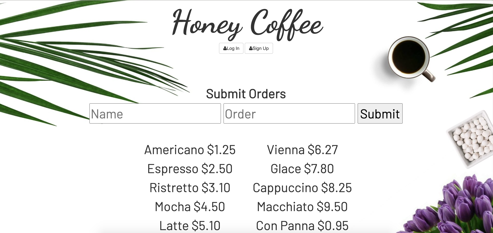
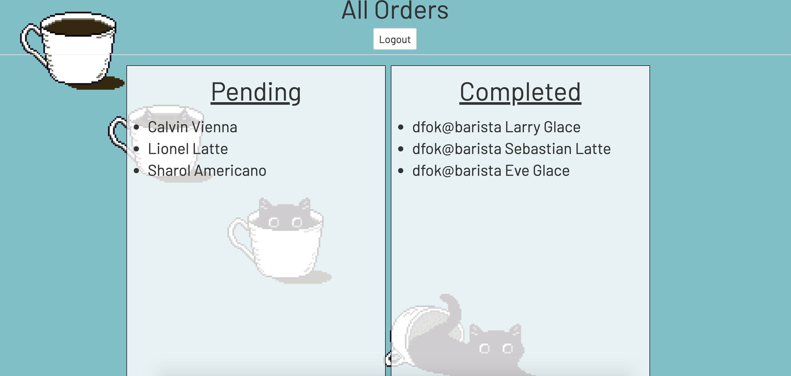

# Barista

## Goal:

An app that enables the barista to enter the customer's name and order. The order is added to a queue that the baristas can log in and mark the order complete. The app automatically says the customer's name out loud when an order is complete.

## How It's Made:

**Tech Used**: HTML5, CSS3, APIs, Javascript, Node.js, MongoDB, Express framework

## Installation

1. Clone repo
2. run `npm install`

## Usage

1. run `node server.js`
2. Navigate to `localhost:8080`

## Credit

Modified from Scotch.io's auth tutorial
